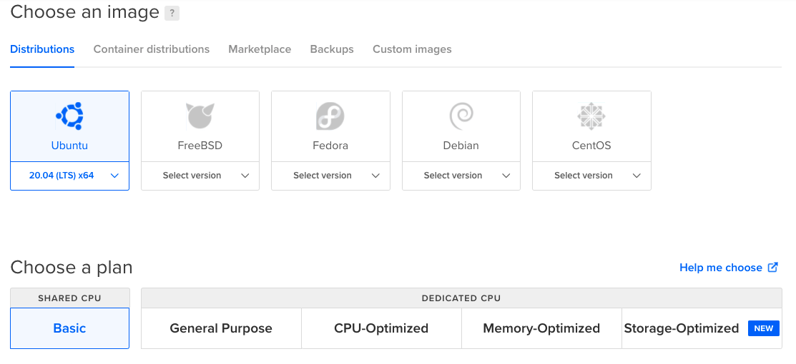

---
parent:
  title: Publish app on Digital Ocean
order: 0
description: Publish the application on an Ubuntu 20.04 droplet on Digital Ocean.
---

# Publish your blockchain app on Digital Ocean

In this tutorial you will learn how to publish your blockchain application on Digital Ocean.

In the first chapter, create a new Cosmos SDk blockchain with Starport.
Upload it to Digital Ocean and configure the firewall, open the ports and then add a SSL certificate with Nginx.

This guide can be helpful with other cloud services, some details might change.
To have the best experience following this tutorial, it is recommended to use Digital Ocean. As operating system from your side, we expect MacOS or a Linux distribution. Be aware when using Windows, some steps might change significantly.

**You will learn how to**

- Create a droplet on Digital Ocean
- Upload your app to the droplet
- Setup a basic firewall
- Open the API with SSL

## Host your app on Digital Ocean

Digital Ocean offers cloud server. We will use the Digital Ocean infrastructure to publish a Cosmos SDK blockchain application. This will ensure the app will run permanently and is accessible on the web. 
To have the app accessible on the web will allow other apps or new nodes to connect to your blockchain network.

### Prerequisites

You will need an account with [Digital Ocean](https://cloud.digitalocean.com/). If you do not have one, the first droplet should come for free, as you get a sign-up bonus from Digital Ocean.

### Installing Go

Before you start using Starport, you should check that your system has Go installed. To do so run:

```
go version
```

If you see `go1.16` (or higher), then you have the right version of Go installed. If the output is `command not found` or installed version of Go is older than 1.16, [install or upgrade Go](https://golang.org/doc/install).

### Installing Starport CLI

To install Starport run the following command:

```
curl https://get.starport.network/starport! | bash
```

This command will fetch the `starport` binary and install it into `/usr/local/bin`. If this command throws a permission error, lose `!` and it will download the binary in the current directory, you can then move it manually into your `$PATH`.


## Create a new droplet on Digital Ocean

Log into your Digital Ocean account, go to the [cloud](https://cloud.digitalocean.com/).
Click on Create in the top bar and then `Droplet`.

We will choose Ubuntu 20.04 (LTS) x64 as image.



In the next step you can choose the size of an image. For a regular (not computing intense) blockchain app, 2GB Ram and 1 CPU are sufficient in size. This droplet comes with a cost of 10 USD per month.


As Authentication, access via ssh key is recommended. [Learn how to setup your SSH key](https://www.digitalocean.com/community/tutorials/how-to-set-up-ssh-keys-2) and use it as authentication method to access your droplet.

Optionally add a droplet name and click "Create Droplet".

In the list of your droplets you see your new droplet. Copy the IP address and open your terminal.

In your terminal, you type `ssh root@<IP address>` to access your new node.

### Setup Your Server

To setup your server, we will need to install a few tools which will help us to publish your blockchain app.
First, install [Go](https://golang.org/dl/).

At the time of writing the version is 1.16.5.

```bash
cd ~
wget https://golang.org/dl/go1.16.5.linux-amd64.tar.gz
sha256sum go1.16.5.linux-amd64.tar.gz
# b12c23023b68de22f74c0524f10b753e7b08b1504cb7e417eccebdd3fae49061  go1.16.5.linux-amd64.tar.gz
```

Extract the archive and keep it in /usr/local

```bash
sudo tar -xvf go1.16.5.linux-amd64.tar.gz -C /usr/local
```

You will now have a directory called go in the /usr/local directory. Next, recursively change this directory’s owner and group to root:

```bash
sudo chown -R root:root /usr/local/go
```

Add the go paths to your profile

```bash
nano ~/.profile
```

At the end of the file, add the following two lines

```bash
export GOPATH=$HOME/go
export PATH=$PATH:$GOPATH/bin:/usr/local/go/bin
```

To update your profile

```bash
source ~/.profile
```

Now you can verify your go installation with 

```bash
go version
```

which should print

```bash
go version go1.16.5 linux/amd64
```

Since we did not add a new user on the Droplet, we will be working with `root` in the `/root` directory.
Create a new directory for your app. 

```
cd /root
mkdir app
```


## Create your Starport app

Create the Starport application on your local computer, which we want to upload to our droplet.
Create a new directory and run Starport to create a new Cosmos SDK blockchain app.

On your local computer, run

```bash
mkdir digitalocean
cd digitalocean
starport app github.com/<username>/<appname>
```

My `<username>` is tosch, while I call the app `digitalocean`, which is for the sake of this tutorial.
You might already have a working blockchain app or create a new one with a new that you can remember easily.

If you want to change any parameters of the blockchain, [learn how to configure](https://docs.starport.network/configure/) your blockchain app with Starport.

## Upload your app to the Droplet

There are a few methods available to upload your app to the Droplet. One convinient way might be to upload the app to GitHub and then download it on your Droplet again. Starport creates a new GitHub repository for you to make it convinient to add it to your repositories.

We will upload the files now with `scp`, to avoid a few extra steps. 

On your local machine, use the following command to upload the app directory to your server.

`scp -r <appname> root@<IP address>:/root/app`

This uploads your local app to your Digital Ocean droplet, into the `/root/app` directory